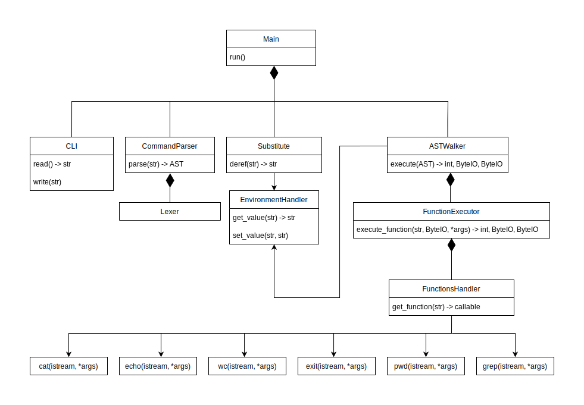

## Домашняя работа 1. Архитектура CLI

### Участники группы

* Носивской Владислав
* Саврасов Михаил
* Левин Лев
* Широков Кирилл

### Структурная диаграмма



### Правила для лексера и парсера

В этой части будут расписаны формальные правила для лексера и парсера,
которые программист перенесет в код (как именно -- будет расписано
позднее)

Синтаксис отсылается к использованию библиотеки `yecc` (`yacc` для Erlang)

Есть отдельный парсер для команд и для аргументов. Это сделано, чтобы
передавать в парсер аргументов вывод команд при перебрасывании вывода в пайпе.


* Лексер

```
Definitions.

WORD = [$_a-zA-Z][$_a-zA-Z0-9]*
WHITESPACE = [\s\t\n\r]

Rules.

|             : pipe.
=             : assign.
"             : double_quote.
[^"]*         : double_quote_interior.
'             : single_quote.
[^']*         : single_quote_interior.
exit          : exit_token.
{WORD}        : word.
{WHITESPACE}+ : skip_token.
```

* Парсер команд (Оставляет аргументы как есть)

```
Nontermials command, assignment, atom, function, var_name, args.
Terminals pipe, word, double_quote, double_quote_interior, single_quote, single_quote_interior.
Rootsymbol command.

Left pipe. (Левоасс. оператор)

command -> command pipe command.
command -> assignment.
command -> atom.
command -> exit_token.
command -> word.

assignment -> var_name assign word.

atom -> function.
atom -> function args.

args -> arg.
args -> arg args.

arg -> word.
arg -> double_quote double_quote_interior double_quote.
arg -> single_quote single_quote_interior single_quote.

var_name -> word.
function -> word.
```

## Архитектурные сущности

### CLI

Основной компонент для взаимодействия с консолью

Методы:

* Чтение строки из консоли
* Вывести строку в консоль
* Геттеры / Сеттеры для потоков ввода/вывода/ошибок


### Lexer

Лексер для токенизации строки. Возвращает список токенов и остаток строки, который
не получилось разобрать.

Правила для лексера описаны выше, от программиста требуется перевести 
правила в код, согласно формату библиотеки [PLY](https://github.com/dabeaz/ply).

### CommandParser

Парсер для первичной обработки команды. Принимает список токенов, возвращает
AST, построенное с помощью библиотеки [PLY](https://github.com/dabeaz/ply)
по грамматике, приведенной выше.

На выходе AST является полностью разобранной командой.

### EnvironmentHandler

Компонент, отвечающий за работу с переменными среды. Хранит внутренние
переменные, которые ввел пользователь.

По имени переменной выдает значение или записывает новое. Если не удалось найти новую переменную
во внутреннем состоянии -- обращается к системе и просит значение переменной.

### FunctionsExecutor

Компонент, исполняющий команду с ее аргументами.
Внутри себя обращается к `FunctionHandler`, получает вызываемый объект.

Метод исполнения должен возвращать кортеж из кода исполнения, потока выходных данных, потока ошибок.
Корректно завершенный вызов имеет код 0, некорректно завершенный вызов внешней функции имеет
код, который передала система; некорректно завершенный вызов внутренней функции имеет код не равный нулю
на усмотрение разработчика.

### FunctionsHandler

Компонент, хранящий наши реализации команд и обращающийся к системе для 
нереализованных команд.

В случае, если не нашлась наша реализация, возвращает лямбду,
которая при вызове обращается к системной реализации команды.

### Substitute

Производит подстановки переменных в строке. Если строка является корректной присваиванием, обрабатывает его.

Ищет очередной оператор `$` в строке и жадно набирает имя переменной 
до пробельного символа или другого оператора `$`. После чего производит подстановку
с помощью `EnvironmentHandler`.

Затем проверяет, является ли строка корректной записью значения в переменную. Если да, выполняет ее, обращаясь к EnvironmentHandler, возвращает пустую строку.
Если строка не является присваиванием, возвращает строку с выполненными ранее подстановками.


### ASTWalker

Компонент, содержащий основную логику исполнения команды.
Принимает AST, которое нужно обойти и выполнить. Для выполнения
команд вызывает `FunctionsExecutor`

### Main

Главный модуль.

Производит взаимодействие с `CLI`.
Для принятой строки вызывает модуль `Substitute`. После этого
проводит строку через лексер и парсер, дальше отдает в `ASTWalker`.
